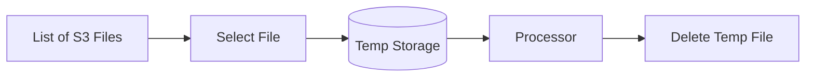

# Metavoice Test

<!-- TOC -->
* [Metavoice Test](#metavoice-test)
  * [Reading of files.](#reading-of-files-)
    * [S3 File reader](#s3-file-reader)
  * [Processing](#processing)
    * [flac_transformer](#flactransformer)
      * [1. Transcription](#1-transcription)
      * [2. Tokenization](#2-tokenization)
  * [Storage](#storage)
  * [Performance](#performance)
  * [Extensibility](#extensibility)
<!-- TOC -->


## Reading of files. 
To read the files from the provided S3 bucket, you must create an AWS profile and set the secret and access keys. The endpoint URL and profile are directly used in the main file.

You can configure this using the aws-cli with the following command:
````
aws configure --profile r2
````
This command will prompt you to enter the following four parameters: 

````
 1. Access Key
 2. Secret Key
 3. Region
 4. File format
````
Configure these parameters based on your credentials and region.

### S3 File reader
For reading the files from the S3 bucket, I have created an interface file_manager, which can be extended according to the implementation. 


For this task, I am listing the files from the S3 bucket, putting them in a list, and then using a generator, I take a single name, download that file to a temporary location using the python library tempfile, which keeps the file in the temp location till my processing is complete. Once the processing is complete, the temp file is deleted.

This helps me keep a single file in memory while processing. The processing can be further enhanced by using a streaming service like Apache Kafka/RabbitMQ or any other message queue to distribute the reading file. 
If we use a message queue service, we can distribute the reading and processing parts among several nodes.



## Processing
For processing, I have created a transformation package in which there are two files, flac_transformer and test_tokens
### flac_transformer
The flac_transformer takes the given input file (.flac file in our case) and processes it. The processing is done in two parts.
#### 1. Transcription
The Transcription part is done using the Openai's Whisper library. The Whisper library gives us different models: tiny, base, medium, and large. For this task, I have used base model to transcribe the audio file. The base model did the transcription part correctly, and the large model took a long time to process small files; hence, the base model.
#### 2. Tokenization
The tokenization is done using the librosa library. I wasn't sure what tokenization wasn't in this case, so I went by the following links and paper I found on the internet regarding discrete audio representation(tokenization)
````
https://arxiv.org/pdf/2309.10922.pdf
https://www.analyticsvidhya.com/blog/2021/06/mfcc-technique-for-speech-recognition/
https://openreview.net/pdf?id=v8Mi8KU6056
````
The code used for tokenization and conversion to torch tensor is 
````
    mfccs = librosa.feature.mfcc(y=audio_np_array, sr=sr, n_mfcc=n_mfcc)
    mfcc_tensor = torch.tensor(mfccs, dtype=torch.float32)
````
The token is then converted into a list (list of lists). the conversion is necessary because we can't store tensors in a parquet file. This conversion facilitates storing the file containing the folder_name, file_name, transcription, and token in parquet format.

Once these two steps are completed, the file is stored in the provided S3 bucket.
## Storage
For storage, I use Pyarrow, fastparquet, and Pandas to store the file in the specified S3 bucket. I also wrote a partition_storage.py to partition the data based on the folder_name and store it in the S3 bucket.

Once all files are processed, the file is written, and a list of dictionaries has been created. The dictionary structure is:
````
 1. folder_name: This contains the folder name (p225)
 2. file_name: Relative path of the file in the S3 bucket
 3. Transcription: Transcribed text of the file
 4. Token: Tokenized representation of the audio file
````
The output file is named data.parquet and is stored in each folder. Folder creation is currently hardcoded in the main file, with the path format: s3://{bucket_name}/output/{partition_name}/data.parquet.
## Performance
The application generates two logs, 
1. application.log - Application logs
2. timing.log - stores time required to process each file, average time per file and total time

The time to transcribe and tokenize the 11756 files was 7864.04 seconds, with the average file processing time being 0.67 seconds.
The time taken depends on the machine as well. With CUDA installed, the average time taken is 0.67 seconds; without CUDA installed, the time taken is around 60 seconds. 


## Extensibility
````
 1. The reading files can be extended by adding implementation of Apache Kafka, which can make the process of reading files distributed.
 2. Use of containerization to spawn multiple pods and process multiple folders sequentially instead of processing files.
 3. Using Dask/Spark to process the file in distributed manner to make the processing faster. 
 4. Using Dask partition to partition the parquet file, instead of manually creating partitions in the S3 bucket.
````
